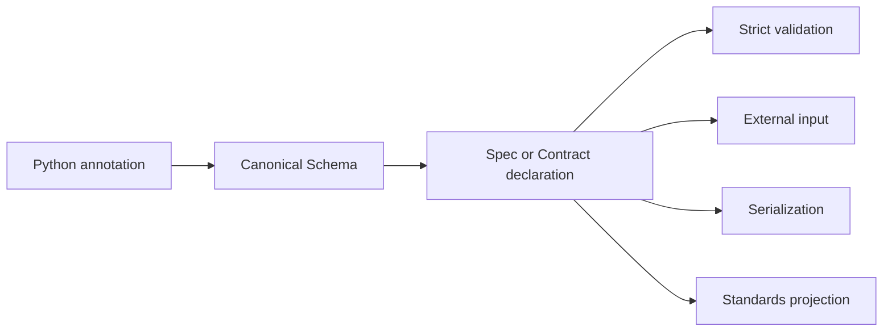

# Mental model

Python annotations are Talea's schema language, but annotations are not
interpreted on every validation. A declaration resolves them once into an
immutable canonical `Schema`. Execution owners compile their own specialized
operations from that truth.



The branches do not reconstruct field or type rules. Validation, input,
serialization, errors, resource accounting, and schema projection have distinct
runtime responsibilities because their semantics differ.

## Six operations

| Operation | Typical API | Contract |
| --- | --- | --- |
| Trusted Python construction | `User(id=1)` | Exact Python values; keyword-only Spec construction |
| Strict arbitrary validation | `Contract(int).validate(1)` | No external conversion |
| External Python conversion | `from_mapping`, `from_python` | Mapping-to-Spec and recursive boundary conversion |
| JSON input | `from_json` | Decode, convert documented representations, validate |
| Python projection | `to_dict`, `to_python` | Detached containers and declared aliases |
| JSON output | `to_json` | Validate, project JSON-safe values, encode |

This separation explains why a string UUID fails strict construction but is a
valid documented representation at a JSON boundary.

## Compile once, reuse

Declaration work happens before the repeated hot path. Talea emits
compiler-owned Python source, compiles it into ordinary CPython bytecode, and
binds application values through globals rather than interpolating them into
source. See [Architecture](../engineering/architecture.md) and [Security
architecture](../engineering/security.md).

## Spec and Contract are two entry points

`Spec` gives a contract nominal record identity, immutable attributes,
defaults, inheritance, hooks, and methods. `Contract` retains an arbitrary
annotation such as `list[User]`, a TypedDict, tagged union, or recursive alias.
Both resolve through the same schema nodes and execution owners.

```python
from talea import Contract, Spec


class User(Spec):
    id: int


users = Contract[list[User]](list[User])
```

Use the class when a record has domain meaning; use the retained annotation when
a wrapper would be ceremony. Neither path is a reduced compatibility mode.

## Three independent field questions

For every field, keep these separate:

1. What values are valid? `str | None` may answer nullability.
2. May ordinary construction omit it? A default or factory answers that.
3. Was it present in a partial external update? A derived presence-aware Spec
   answers that.

Confusing them causes PATCH bugs such as treating absent as `None` or assuming a
default-equal value was omitted. Canonical declaration and presence truth keep
each answer independently inspectable.

## Input, output, and schema agree through ownership

An alias belongs to the field declaration. Input reads it, output writes it,
errors locate it at external boundaries, and schema publishes it. A tagged
union's branch Literal owns the tag; OpenAPI projects the same mapping used for
runtime dispatch. A recursive named identity owns the `$ref` back-edge rather
than each subsystem inventing a recursion registry.

This does not mean every operation has identical behavior. Input/output modes
can differ, and an arbitrary transform or serializer can make one schema
direction unknowable. Agreement means those differences are explicit
consequences of canonical truth rather than accidental reinterpretations.

## Trust is shallow and evidence-based

An immutable Spec containing only transitively immutable values can be reused as
permanently validated. A Spec containing a list or dictionary is not deeply
frozen; later boundaries revalidate current state. Sensitive metadata protects
Talea-owned failure/repr surfaces but does not erase the valid field or sandbox
callbacks.

The mental model is therefore not “models are always safe.” It is: declarations
own contracts, operations own boundaries, and trust is granted only for the
invariants each operation actually established.

## A production reading order

After this model, read [Specs](specs.md), [strictness](strictness-boundaries.md),
and [Contract](../contracts.md). Then choose the boundary-specific guide:
[input](../input-boundaries.md), [serialization](../serialization.md),
[PATCH](../presence-derived-contracts.md), [events](../tagged-unions.md), or
[schemas](../json-schema-openapi.md). Security reviewers should also read the
[resource model](../resource-security.md); framework authors should use
[introspection](../reference/introspection.md).
