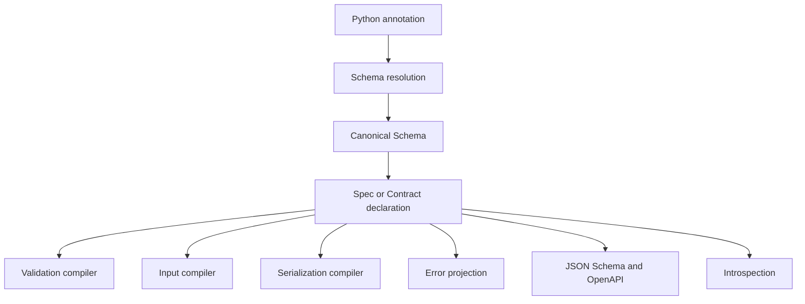

# Architecture

Talea uses Single Owner Architecture: every important semantic truth has one
canonical owner, while runtime and tooling domains consume or project it.

Field names, types, aliases, constraints, metadata, requiredness, recursive
identity, and discriminator truth are not reinterpreted by each branch.

## Independent domains

| Domain | Owns |
| --- | --- |
| schema | immutable resolved annotation structure |
| declaration | effective Spec fields, inheritance, defaults, hooks, trust, presence |
| validation | strict success/failure execution |
| input | Mapping/JSON conversion and boundary aggregation |
| serialization | Python/JSON projection and codecs |
| errors | stable detail, safe snapshots, rendering, JSON projection |
| tagged unions | one discriminator dispatch map |
| recursive references | finite named back-edges and lazy publication |
| resources | operation-local input budgets |
| standards projection | Draft 2020-12 and OpenAPI Schema Objects |

## Canonical owner map

The 0.2 capabilities extend existing owners rather than creating parallel
representations:

| Truth | Canonical owner | Consumers |
| --- | --- | --- |
| dataclass stored fields and lifecycle classification | immutable `DataclassSchema` resolved by `schema` | validation, input, serialization, introspection, standards projection |
| `ReadOnly`, `WriteOnly`, aliases, and `Sensitive` | normalized declaration metadata | derivation, input/output, errors, introspection, standards projection |
| derived source, retained/omitted fields, selection, partial state, mode, and explicit name | immutable declaration provenance | presence, patching, introspection, standards projection |
| nested include/exclude grammar and immutable selection tree | serialization selection owner validated against canonical schema | class-owned compiled output plans |
| selected-plan retention | each Spec declaration's output artifacts | that class only, bounded to 32 immutable plans |
| external-input budgets | operation-local `ResourcePolicy` state | Mapping and JSON input compilers |
| JSON representations | canonical JSON representation owner | JSON input, JSON output, and standards projection |
| public validation failures | `ErrorCode`, `ErrorData`, and `ValidationError` | every validation and input execution target |
| represented domain values | one immutable `RepresentationSchema` association between internal, input, output, and callback identity | strict validation, input/output compilation, standards projection, introspection, and nested selection |

Dataclass execution specializes from `DataclassSchema`; it does not retain a
second field map or rediscover `dataclasses.fields()`. Directional derivation
projects normal Spec declarations from one provenance record. Nested selection
copies caller input into an immutable tree before field access, compiles only
when a nested selector is used, and has no process-global cache.

### Representation ownership

The representation declaration is
`Annotated[Internal, Representation(...)]`. Resolution creates one
`RepresentationSchema`; execution does not scan metadata again and there is no
callback registry. Strict validation consumes only the internal schema. An
external Python or decoded-JSON value is processed by the declared input
schema, passed to the synchronous loader once, and the result is validated by
the internal schema before it can escape.

Callbacks are trusted application code: their own work is not budgeted or
rolled back. Talea-owned traversal before and after the callback shares the
same operation-local `ResourcePolicy` state, so a small input expanded into a
large structural result remains bounded. Opaque represented classes receive an
exact runtime-type check, not permanent trust in hidden state. Existing
supported internal schemas retain their normal structural and trust rules.

Ordinary unions keep Talea's canonical branch ordering. A represented branch
is attempted only when its declared input schema is structurally plausible;
its loader `ValueError` becomes a branch validation failure and may allow the
next branch to run, while other exceptions propagate. Consequently trusted
loader side effects can occur in more than one attempted branch, and every
attempted input/result traversal consumes the shared resource budget. A union
with multiple representation declarations for the same internal contract is
rejected because callback ordering would otherwise be indistinguishable.

Python 3.14 has no `TypeForm`, so the runtime `input` and `output` type-form
parameters use `object` annotations. Generic callback relationships still
express `InputT -> InternalT` and `InternalT -> OutputT`; runtime resolution
validates the actual type forms. Moving to Python 3.15 `TypeForm` can strengthen
those two annotations without changing declaration vocabulary or behavior.

Output validates current internal truth, invokes the directly bound dumper once,
validates the candidate against the declared output schema, and feeds that
schema's normal Python or JSON projector. Standards modes project the declared
input or output schema without executing callbacks. Callback-free
`RepresentationInfo` and structural nested selection are projections of the
same node, not additional declaration models. A missing direction fails
explicitly and never falls through to `repr`, `__dict__`, or internal-object
serialization. `Representation` is root-public because these owners now form
one complete boundary contract.

## Why compile generated Python

Repeated validation should not reflect on annotations or interpret a generic
schema tree. Talea emits specialized Python source once and compiles it into
ordinary CPython bytecode. Compiler-owned templates provide syntax. Runtime
classes, constants, patterns, callbacks, and error constructors enter through
validated names and bound globals rather than source interpolation.

This approach makes generated execution inspectable with normal Python tools
and keeps the runtime pure Python. It also creates a security obligation,
addressed by name validation, non-interpolation rules, annotation-resolution
controls, and injection tests. See [Security architecture](security.md).

## Extension rule

New validators, serializers, adapters, or tooling should consume the canonical
schema and declaration. An extension that rereads annotations or duplicates
type semantics creates a competing truth path and is incompatible with the
architecture.

## One field through every operation

Consider
`display_name: Annotated[str, Alias("displayName", legacy=("name",)), MinLength(1)]`.
Resolution owns the exact string contract, effective lower bound, canonical
Python name, current external name, and accepted historical input names. From
there:

- generated construction validates the exact string and length under the
  Python name;
- Mapping/JSON input reads exactly one of `displayName` or `name`, rejects both
  as `alias_conflict`, and reports the current external path;
- serialization projects `displayName` unless alias output is disabled;
- JSON Schema uses the current `displayName` and `minLength: 1` without
  publishing legacy runtime-input vocabulary;
- introspection reports the Python, current, legacy, and complete accepted
  names plus the normalized constraint;
- derived partial Specs retain the same field truth while changing presence.

No subsystem independently rereads `Annotated`. This prevents the class of
bugs where validation accepts one name while schemas publish another, or PATCH
forgets a constraint owned by the source.

## Declaration and lazy operation lifecycle

Class creation validates field order, defaults, inheritance, hooks, aliases,
metadata, generic state, and supported annotations. It publishes an immutable
declaration only after that work succeeds. The strict constructor is generated
for concrete Specs; other operations compile on first use and are retained by
the declaration or Contract.

This is “compile once,” not “compile the entire library eagerly.” A Spec that
never parses JSON does not pay to build JSON input. A Spec that never uses
replacement has no replacement operation. Recursive and mutually dependent
declarations publish through finite references and guarded lifecycle state so
the first caller cannot observe a partly initialized graph.

## Why execution paths stay separate

Trusted construction, strict arbitrary validation, external Mapping input,
JSON decoding/conversion, Python output, and JSON output have overlapping
schema truth but different jobs:

| Path | Work it uniquely owns |
| --- | --- |
| construction | keyword/default/factory lifecycle and atomic instance commit |
| strict validation | accept an already-correct Python value without conversion |
| external Mapping | structural conversion, nested Spec construction, policy, aggregation |
| JSON input | transport check, strict/default codec, JSON representations, conversion |
| Python output | detached Python representation and current-state validation |
| JSON output | JSON-specific representation followed by a codec |

Routing all six through one interpreted adapter would obscure trust and charge
simple operations for features they do not use. Sharing canonical truth does
not require sharing one runtime pipeline.

## Immutability, trust, and mutable children

Spec field bindings are immutable, but a list or dictionary stored in a field
remains an ordinary mutable Python object. Canonical schema classifies whether
instances are permanently trustworthy. Nested immutable scalar-only Specs can
take trusted composition paths; reachable mutable state is revalidated when it
crosses a later validation, replacement, or serialization boundary.

This avoids deep-freezing the Python object ecosystem while refusing to assume
that an earlier validation permanently protects a mutable child. It also makes
the cost model explicit: mutable current state pays for current-state proof.

## Failure ownership and security consequences

Success paths do not allocate rich error detail. When an operation fails, the
error owner snapshots bounded representations, applies Sensitive redaction,
retains stable facts, and renders human text lazily. External traversal shares
one operation-local resource state across recursive references and tagged
branches; state is not global and cannot leak between calls.

Generated-code safety follows the same ownership rule. Templates own syntax;
classes, constants, regular expressions, callbacks, and user names are bound as
runtime values after validation rather than interpolated into source. See the
[security model](../resource-security.md) for the full threat boundary.

## How to evaluate an extension

Before adding a new type, constraint, serializer, or framework adapter, ask:

1. Which canonical node owns its structural truth?
2. Which existing execution owners must consume it?
3. Can unused declarations avoid runtime cost?
4. What strict Python and JSON representations are promised?
5. How do errors, Sensitive state, recursion, and resource accounting compose?
6. Can schema and introspection project it honestly?

The architectural kill test is concrete: after the change, no second subsystem
should be able to disagree about that feature's type, input, output, or schema
meaning because no second subsystem owns a competing interpretation.
