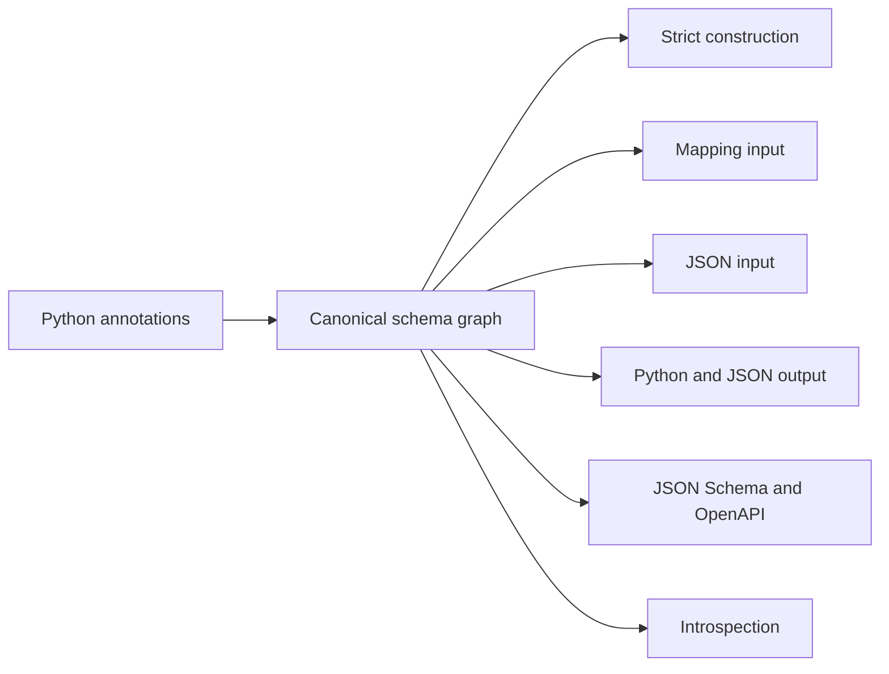

# Talea

<p align="center">
  <a href="https://talea.tarsild.io"></a>
</p>

<p align="center">
    <em>Data contracts, built for modern Python</em>
</p>

<p align="center">
<a href="https://github.com/tarsil/talea/actions/workflows/test-suite.yml/badge.svg?event=push&branch=main" target="_blank">
    
</a>

<a href="https://pypi.org/project/talea" target="_blank">
    
</a>

<a href="https://pypi.org/project/talea" target="_blank">
    
</a>
</p>

---

**Documentation**: [https://talea.tarsild.io](https://talea.tarsild.io) 📚

**Source Code**: [https://github.com/tarsil/talea](https://github.com/tarsil/talea)

**The official supported version is always the latest released**.

---

Talea is a **2026+ Python data-contract library** built for strict Python
semantics, explicit external boundaries, immutable records, and standards-aware
schemas. It targets Python 3.14+, is implemented in pure Python, and declares
zero required runtime dependencies.

An annotation becomes one canonical contract. Talea then compiles separate,
specialized operations for trusted construction, external Mapping input, JSON
input, Python output, JSON output, and standards projection. The result is a
boundary model that remains visible in application code and inspectable by
frameworks.

## See the model in five minutes

{!> ../../../docs_src/getting_started/quickstart.py !}

The direct constructor is strict: a field declared as `int` accepts an exact
Python integer, not `"1"`, `1.0`, or `True`. `from_json()` is deliberately a
different operation. It understands the documented JSON representations of
values such as UUID, `datetime`, `Decimal`, IP addresses, paths, and bytes,
then validates the resulting contract.

That distinction prevents conversion from becoming an invisible property of
every Python assignment. Application code can see where external data entered,
where finite resource limits applied, and where an already-valid object took a
short trusted path.

## The problem Talea addresses

Typed storage is only one part of a production data boundary. An API request,
event message, third-party payload, or persistence document also needs:

- predictable input conversion rather than ambient coercion;
- nested locations and stable machine-readable errors;
- safe handling for rejected sensitive values;
- finite work on oversized, deep, broad, or highly invalid external input;
- serialization that agrees with validation and aliases;
- JSON Schema and OpenAPI projection that describe implemented behavior;
- introspection that frameworks can consume without repeating annotation
  resolution;
- a performance model that does declaration work once and keeps unused
  features off simple hot paths.

Talea treats those as related projections of one contract, not as independent
subsystems free to reinterpret the fields.



## A realistic boundary

A framework-neutral service can place Talea at the exact transport seam:

```text
raw request bytes
    -> ResourcePolicy
    -> UserCreate.from_json(...)
    -> ValidationError or ResourceLimitError
    -> application/domain operation
    -> UserResponse
    -> to_json()
```

The [production service tutorial](getting-started/production-service.md) makes
that complete flow executable with nested account data, aliases, constraints,
credentials, redaction, invalid payloads, resource rejection, response
serialization, and input/output OpenAPI fragments. It does not require or
pretend to be a web framework: route registration and HTTP policy remain with
FastAPI, Lilya, Django, Starlette, Flask, or the embedding system.

For partial updates, Talea keeps presence as first-class truth:

```python
UserPatch = derive_spec(User, partial=True)
patch = UserPatch.from_json('{"displayName":"Grace"}')

assert patch.present_fields == frozenset({"display_name"})
updated = apply_patch(existing_user, patch)
```

An absent field is not rewritten as `None`, and a value equal to a default is
still present when explicitly supplied. The [PATCH guide](presence-derived-contracts.md)
covers aliases, defaults, sensitive fields, empty patches, failed whole-object
invariants, serialization, and schemas.

## Two declaration surfaces, one contract system

Use `Spec` for a named, immutable record with attributes, defaults, methods,
inheritance, and validation hooks. Use `Contract` when the useful root already
has another shape:

```python
from decimal import Decimal
from uuid import UUID

from talea import Contract


identifiers = Contract[list[UUID]](list[UUID])
balances = Contract[dict[str, Decimal]](dict[str, Decimal])

ids = identifiers.from_json(
    '["12345678-1234-5678-1234-567812345678"]'
)
amounts = balances.from_json('{"CHF":"42.50"}')
```

`Contract` also covers stdlib dataclasses, TypedDicts, tagged unions, PEP 695
aliases, recursive graphs, and concrete generic specializations. It exposes `validate`,
`from_python`, `from_json`, `to_python`, `to_json`, `json_schema`, and
`openapi_schema` without requiring a wrapper class. See [Arbitrary
contracts](contracts.md) for the full boundary matrix and production examples.

## What “2026+” means

Talea asks what a Python data-contract library should look like if it were
designed today, for modern Python, without inherited compatibility constraints.
Starting with Python 3.14 allows PEP 695 generic syntax, deferred annotations,
current typing/runtime behavior, and recursive type graphs to be architectural
assumptions from the beginning rather than optional compatibility layers.

It does **not** mean guaranteed future superiority, a prediction that the
ecosystem will replace mature libraries, that other libraries are “legacy,” or
that Talea will always be faster. Mature projects serve public contracts and
version ranges that Talea never had to preserve. That is a design circumstance,
not a criticism. [Why Talea?](getting-started/why-talea.md) develops the
technical consequences in detail.

## What is included

| Area | Implemented surface |
| --- | --- |
| Records | strict keyword-only immutable slotted Specs, defaults/factories, inheritance, generics, recursion |
| Validation | exact Python types, constraints, transforms, field and whole-Spec checks, structured errors |
| Boundaries | trusted Python, external Mapping, strict JSON, arbitrary Contract roots |
| Callables | strict compiled sync/async argument and return validation with native Python binding and methods |
| Composition | nested Specs, stdlib dataclasses, TypedDict, aliases, represented custom domain types, unions, canonical tagged dispatch, recursive named graphs |
| Updates | `copy.replace`, `derive_spec`, presence-aware partials, `apply_patch` |
| Output | detached Python projection, JSON representations, nested selection, field serializers with optional declared output truth, per-call codec boundaries |
| Security | Sensitive-aware failure redaction; finite transport, depth, work, and error budgets |
| Standards | JSON Schema Draft 2020-12 and OpenAPI 3.1-compatible Schema Objects |
| Tooling | immutable field/schema introspection and dynamic `create_spec` declarations |
| Execution | compile-once specialized pure-Python operations and permanent benchmark canaries |

## Not a competition

Talea is not trying to replace Pydantic, msgspec, dataclasses, attrs, or
manually written validation. Different projects make different tradeoffs.

- Pydantic brings broad adoption, extensive integrations, a mature ecosystem,
  and coercive/parsing workflows many applications actively want.
- msgspec brings an extremely fast native implementation, mature serialization,
  and representation/performance choices that may already fit a workload.
- dataclasses and attrs remain excellent for internal records; a stdlib
  dataclass can also retain that role behind a Talea `Contract` boundary.
- direct Python remains the clearest answer for a sufficiently small or
  specialized contract.

Talea offers another design point: strict, dependency-light, Python-native,
compile-once, explicit-boundary, introspectable, standards-aware, and
security-conscious. The [comparison](engineering/comparison.md) and [adoption
guide](guides/adoption.md) use concrete scenarios rather than a winner/loser
ranking.

## When Talea is a fit

Evaluate Talea when a Python 3.14+ system needs predictable request or event
boundaries, wants conversion to be explicit, values an empty required runtime
dependency graph, and can use structured failures, security budgets, schemas,
or introspection. Its compile-once model is especially relevant when the same
contract executes repeatedly after application startup.

Do not choose Talea only because it is newer. It is probably not a good fit
when an application depends deeply on Pydantic-specific integrations, must run
on older Python, wants broad coercion, needs settings/ORM ecosystems in one
package, already has an ideal msgspec workflow, needs only a tiny internal
record, or can express a specialized check more clearly by hand.

Talea deliberately remains in the 0.x series and has a much smaller ecosystem
than mature alternatives. Its compatibility and support policy may continue to
evolve across 0.x releases.
The [limitations](engineering/limitations.md) and [maturity/support
page](release-ledger.md) make that cost explicit.

## Choose a path

| Goal | Start here | Then continue to |
| --- | --- | --- |
| Build a first contract | [Quickstart](getting-started/quickstart.md) | [Progressive tutorial](getting-started/tutorial.md) |
| Integrate an API boundary | [Production service](getting-started/production-service.md) | [Input](input-boundaries.md), [errors](error-experience.md), [security](resource-security.md) |
| Model partial updates | [PATCH and presence](presence-derived-contracts.md) | [`derive_spec` / `apply_patch` API](reference/api.md#derive_spec-and-apply_patch) |
| Consume event messages | [Tagged unions](tagged-unions.md) | [Recursion/generics](recursive-generics.md), [schemas](json-schema-openapi.md) |
| Validate arbitrary roots | [Contract](contracts.md) | [Supported types](supported-types.md) |
| Validate function boundaries | [Callable boundaries](callable-boundaries.md) | [Typing](reference/typing.md), [introspection](reference/introspection.md) |
| Represent custom domain types | [Custom representations](custom-representations.md) | [Serialization](serialization.md), [schemas](json-schema-openapi.md) |
| Build framework tooling | [Introspection](reference/introspection.md) | [OpenAPI](json-schema-openapi.md), [architecture](engineering/architecture.md) |
| Perform security review | [Resource and security model](resource-security.md) | [Security summary](engineering/security.md) |
| Evaluate adoption | [Why Talea?](getting-started/why-talea.md) | [Comparison](engineering/comparison.md), [enterprise questions](engineering/enterprise-evaluation.md) |
| Reproduce evidence | [Performance](engineering/performance.md) | [Contributing](contributing.md) |

Every substantial flow is owned by an executable `docs_src` program. The docs
gate runs those examples with assertions and also checks navigation, links,
public API inventory, headings, and documentation policy.
