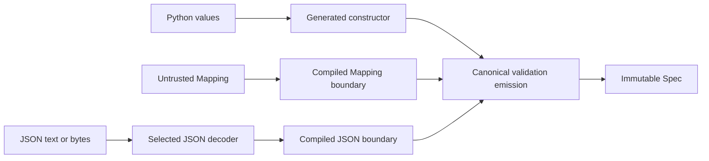

# Input boundaries

Talea separates already-typed Python construction from external data. The
boundary is explicit in the API, so adding parsing does not add a mode branch to
ordinary construction:

| Operation | Intended input | Conversion policy | Field errors |
| --- | --- | --- | --- |
| `User(...)` | Already-valid Python values | Strict; only declared transforms | Fail fast |
| `User.from_mapping(data)` | Untrusted Python `Mapping` | Strict Python types plus nested Mapping-to-Spec construction | Aggregate independent fields |
| `User.from_json(data)` | Serialized JSON | Decode JSON representations according to the declared schema | Aggregate independent fields |



The decoder owns JSON syntax only. Talea's canonical schema and validation
emitter continue to own types, constraints, hooks, error locations, nested
trust, and immutable slot commitment.

## Constructing from a Mapping

`from_mapping` is the one Python external-data API:

```python
from types import MappingProxyType

from talea import Spec


class Address(Spec):
    city: str


class User(Spec):
    identifier: int
    name: str
    address: Address


user = User.from_mapping(
    MappingProxyType(
        {
            "identifier": 1,
            "name": "Ada",
            "address": {"city": "Zurich"},
        }
    )
)
```

The top level accepts `collections.abc.Mapping`, including `dict`, mapping
proxies, and deliberate custom implementations. Keys must be exact field names.
Aliases and silent extra-field ignoring are not available. A non-string key is
an unexpected field.

Python values remain strict. For a field declared as `int`, the string `"20"`
fails. A `list` does not become a `tuple`, `set`, or `frozenset`; UUID, date,
path, IP, Enum, and Decimal strings do not become their Python types. Declare a
`transform` when a particular Python boundary intentionally accepts another
representation.

A Mapping supplied where a Spec is declared constructs that nested Spec. This
also works beneath supported lists, dictionaries, tuples, sets, frozensets, and
unions when the containing Python container already has its declared type.
Locations compose through every boundary. An existing compatible Spec is
retained by identity and receives the established permanent or current-state
trust behavior. A nested Spec created successfully during the same operation is
not immediately revalidated.

Boundary conversion may rebuild a container when one of its members must become
a nested Spec. Applications should not use `from_mapping` to establish container
identity; direct `Spec(...)` construction remains the identity-preserving
already-Python path.

## Missing, unexpected, and aggregated errors

Boundary failures use the same `ValidationError` and `errors()` projection as
ordinary construction. Missing required fields use `missing`; unknown keys use
`unexpected`. Defaults and factories mean a field is not missing.

Independent field problems are returned together in observable order:

1. declared fields in canonical declaration order;
2. each missing, structural, constraint, transform, or field-check failure at
   its declared position;
3. unexpected keys in the Mapping's encounter order.

```python
from typing import Annotated

from talea import Ge, Spec, ValidationError


class Registration(Spec):
    identifier: int
    name: str
    age: Annotated[int, Ge(18)]


try:
    Registration.from_mapping(
        {
            "identifier": "bad",
            "age": 15,
            "extra": True,
        }
    )
except ValidationError as exc:
    assert [(item["code"], item["location"]) for item in exc.errors()] == [
        ("type", ["identifier"]),
        ("missing", ["name"]),
        ("greater_than_or_equal", ["age"]),
        ("unexpected", ["extra"]),
    ]
```

The error list is allocated only after the first failure. A failure inside one
container or compact union remains that field's structural failure; Talea does
not build an unlimited combinatorial error tree.

Whole-Spec checks run only after every field is valid. Default factories are
also delayed until supplied fields and the external key set are valid, so a
missing required field, invalid supplied field, or unexpected key cannot cause
unnecessary user code to run. Once that phase succeeds, omitted factories run
in declaration order exactly once and their outputs follow the normal transform,
structure, constraint, and field-check lifecycle.

## JSON input

`from_json` accepts `str`, `bytes`, and `bytearray`:

```python
from datetime import datetime
from uuid import UUID

from talea import Spec


class Event(Spec):
    identifier: UUID
    occurred_at: datetime
    coordinates: tuple[float, float]


event = Event.from_json(
    b'''{
        "identifier": "00000000-0000-0000-0000-000000000000",
        "occurred_at": "2026-08-26T12:30:00+00:00",
        "coordinates": [47.3769, 8.5417]
    }'''
)
```

The default decoder is `json` from the standard library with three deliberate
policies:

- duplicate object keys raise `json_duplicate` rather than silently keeping a
  later value;
- `NaN`, `Infinity`, and `-Infinity` raise `json_invalid`;
- fractional number tokens are initially preserved as `Decimal`, preventing a
  Decimal field from receiving an already-rounded float.

The compiled input function then converts the decoded representation according
to each field's canonical schema. A float field receives a finite Python float;
a Decimal field receives the exact token value. A custom decoder that returns a
float for a Decimal field is rejected rather than converted through a lossy
path.

### JSON representation table

| Declared contract | Accepted inbound JSON representation | Result |
| --- | --- | --- |
| `int`, `str`, `bool`, `None`, `Literal` primitives | Corresponding JSON primitive | Same strict primitive |
| `float` | Finite JSON number | Python `float`; integer tokens are accepted |
| `Decimal` | Finite JSON number | Exact `Decimal`; no float intermediate on the default path |
| `list[T]` | Array | List |
| `tuple[...]`, `tuple[T, ...]` | Array | Tuple |
| `set[T]`, `frozenset[T]` | Array | Set or frozenset; duplicate members collapse normally |
| `dict[str, T]` | Object | Dictionary; object keys remain strings |
| nested `Spec` | Object | Nested Spec |
| `UUID` | String | `UUID` |
| `datetime`, `date`, `time` | ISO string accepted by the corresponding `fromisoformat` | Temporal value |
| supported path types | String | Declared nominal path family |
| supported IP address/network/interface | String | Exact declared IP family |
| Enum with a JSON-compatible value | That exact value and primitive type | Declared Enum member |
| `timedelta` | No representation frozen | Rejected |
| `bytes` | No representation frozen | Rejected unless a transform explicitly supplies bytes |

Boolean and integer identity remains distinct in Literals and Enum values. JSON
object keys are not coerced to integer, UUID, or other dictionary key types.
Malformed standard-library strings retain the field's normal structural error
and exact location.

For a union, alternatives are considered in declaration order and the first
alternative whose boundary conversion and canonical validation succeed wins.

## Transforms and checks

Both external boundaries use one understandable lifecycle:

1. obtain the raw Python value or decoded JSON-native value;
2. run declared transforms in order;
3. perform boundary-specific nested or JSON representation conversion;
4. run canonical structural validation and constraints;
5. run field checks;
6. after all fields succeed, run whole-Spec checks and commit slots.

A JSON transform therefore sees the decoded representation. For a UUID string,
it sees `str`; its output then enters Talea's UUID conversion. This matches the
Mapping lifecycle and gives an explicitly declared transform the earliest
application-controlled input point. Every transform and check runs once for a
successfully constructed value.

## Selecting another JSON decoder

Pass a one-argument decoder explicitly per operation:

```python
import orjson

event = Event.from_json(payload, loads=orjson.loads)
```

Talea does not import or depend on `orjson`; the example requires the
application to install it. A decoder callable must accept the supplied `str`,
`bytes`, or `bytearray` and return a JSON-native tree of dictionaries, lists,
strings, integers, floats, booleans, and `None`. Extended returned Python values
are accepted only if the declared boundary semantics validate them.

A custom decoder owns syntax behavior. If it raises `ValueError`, Talea reports
`json_invalid`; the decoder exception is retained as the cause for bounded
inputs and omitted for large inputs. Other exceptions propagate as decoder or
application defects. Once a decoder has discarded
duplicate-key evidence, Talea cannot reconstruct it; applications requiring
duplicate rejection must select a decoder configured to provide that guarantee.
Likewise, a decoder used with Decimal fields must preserve fractional values as
Decimal rather than float.

There is no global mutable codec registry or process-wide JSON setting. The
callable is not stored on the Spec declaration or instance. A future outbound
JSON API can use the symmetric per-call `dumps` shape without replacing this
input abstraction; outbound serialization is not implemented here.

## Malformed input and parser limits

Default malformed JSON raises `ValidationError` with `json_invalid`. When the
standard decoder provides them, `context` contains `line`, `column`, and
`position`; these describe the serialized source and are separate from Talea's
field `location`. Invalid UTF-8 reports byte offsets and the decoder reason.
Error projections bound the displayed input. Small standard parser failures are
retained as `__cause__`; large documents do not retain the decoder exception
that would otherwise keep the complete source alive.

Talea adds no speculative document-size or nesting limit. Standard decoder
resource behavior therefore still applies. Applications accepting unbounded
hostile payloads should enforce transport limits before decoding. Custom
Mapping methods and non-`ValueError` decoder exceptions are application code and
propagate rather than being mislabeled as field failures.

## Performance model

Each Spec declaration retains a small boundary owner but does not compile its
Mapping or decoded-JSON function until that operation is first used. The two
functions are independent: using `from_mapping` does not compile JSON support.
First-use installation is synchronized; repeated calls bypass the lock and
perform no annotation reflection or schema traversal. This keeps ordinary class
declaration and the generated `Spec(...)` constructor free of Mapping
extraction, codec selection, missing/unexpected checks, and aggregation state.

Complete exact dictionaries with required fields use direct constant-key
extraction before the general Mapping path. Missing or unexpected shapes fall
back before transforms or factories run, preserving aggregation and once-only
callback behavior.

JSON timings should be separated into decoder-only, Talea boundary-only, and
full JSON-to-Spec work. A faster optional decoder changes the first category;
it does not replace or weaken Talea validation. No codec or input metadata is
stored per Spec instance.
