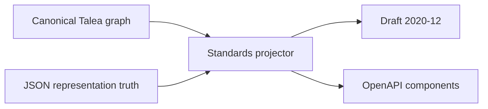

# JSON Schema and OpenAPI projection

Talea projects its canonical declaration graph into JSON Schema Draft 2020-12
and OpenAPI 3.1 Schema Objects. Projection does not inspect annotations or
compile a second validation system.

```python
from typing import Annotated

from talea import Alias, Ge, Spec


class User(Spec):
    id: Annotated[int, Ge(1), Alias("identifier")]
    name: str
    active: bool = True


schema = User.json_schema()
```

`Contract` exposes the same capability for arbitrary supported roots:

```python
from talea import Contract


integer_list = Contract[list[int]](list[int])
schema = integer_list.json_schema()
```

The selected JSON Schema dialect is
[Draft 2020-12](https://json-schema.org/draft/2020-12). Every standalone
document declares:

```json
{"$schema": "https://json-schema.org/draft/2020-12/schema"}
```

OpenAPI projection targets the
[OpenAPI 3.1 Schema Object dialect](https://spec.openapis.org/oas/v3.1.2.html#schema-object),
whose base is Draft 2020-12. It has been validated as an OpenAPI 3.1.2
document fragment. OpenAPI 3.2 retains the same base dialect, but Talea does
not emit 3.2-only vocabulary.



## Public API

Concrete Specs and retained Contracts provide two explicit operations:

```python
User.json_schema(mode="input")
User.json_schema(mode="output")

Contract(User).openapi_schema(mode="input")
Contract(User).openapi_schema(mode="output")
```

`json_schema()` returns a fresh `dict[str, object]`. Named declarations use
`$defs` and local `$ref` values:

```json
{
  "$schema": "https://json-schema.org/draft/2020-12/schema",
  "$ref": "#/$defs/User",
  "$defs": {
    "User": {
      "type": "object",
      "properties": {
        "identifier": {"type": "integer", "minimum": 1},
        "name": {"type": "string"},
        "active": {"type": "boolean", "default": true}
      },
      "additionalProperties": false,
      "required": ["identifier", "name"]
    }
  }
}
```

`openapi_schema()` returns a fragment with `schema` and `components` keys:

```python
fragment = User.openapi_schema()

document = {
    "openapi": "3.1.2",
    "info": {"title": "Example", "version": "1"},
    "paths": {},
    "components": fragment["components"],
}

request_schema = fragment["schema"]
```

This shape lets framework adapters consume the root Schema Object and merge
component schemas without reading Talea internals. Talea does not generate
paths, operations, request bodies, responses, or route registration.

Every call returns independent mutable dictionaries. Talea does not retain a
global schema registry and does not hand callers shared cached state.

## Input and output modes

JSON input and JSON output can have different representations. A single
unqualified schema would be inaccurate for `Decimal`, serializers, set
uniqueness, and complete output objects. The default is `mode="input"` because
schema consumers most commonly describe incoming documents.

Input mode describes values accepted after JSON decoding and Talea's canonical
boundary conversion. Output mode describes values emitted by `to_json()`.

For ordinary Specs:

- input `required` contains fields whose canonical `SpecField.required` is
  true;
- output `required` contains every non-omittable field because normal Spec
  instances serialize complete state;
- partial derived Specs use `SpecField.omittable` directly, so both modes may
  omit absent fields;
- TypedDict requiredness is identical in both modes and comes from its
  canonical `total`, `Required`, and `NotRequired` truth.
- dataclass input contains only `init=True` constructor fields, while output
  contains every stored field; `init=False` output properties are required and
  marked `readOnly`.

`ReadOnly` and `WriteOnly` remain annotations in both modes. Talea does not use
them to change runtime input or output behavior.

### Callback-defined domains

An arbitrary transform can accept values outside the field's structural
contract. Talea cannot infer that callback's input domain. Input projection of
a transform-bearing Spec therefore raises `SchemaProjectionError`.

An arbitrary field serializer can return a different output type. Output
projection of a serializer-bearing Spec raises the same focused error because
the callback has no declared return contract.

The opposite modes remain projectable: transforms do not change output, and
serializers do not change accepted input.

Custom `check` callbacks are different. They do not change structural shape,
so projection emits known structure and built-in constraints. Arbitrary check
predicates remain runtime-only and can reject documents that satisfy the
generated schema.

## Objects, aliases, and requiredness

Spec schemas use the canonical external field name. An `Alias` replaces the
Python attribute name in `properties`, `required`, nested paths, and
discriminator `propertyName`. Talea does not emit both names.

Spec, TypedDict, and dataclass boundaries reject unknown keys, so their schemas
use:

```json
{"additionalProperties": false}
```

TypedDict keys remain exactly as declared. `typing.ReadOnly` becomes
`readOnly: true`; it still does not make dictionaries immutable at runtime.

Dictionary contracts project as JSON objects only when the key contract can
accept exact JSON string keys. `dict[str, T]` uses `additionalProperties` for
`T`. A string `Literal` key contract additionally uses `propertyNames.enum`.
Non-string key contracts raise `SchemaProjectionError` instead of claiming
that JSON object keys have a Python representation they cannot have.

## Defaults and metadata

A validated static default is emitted as `default` only when Talea can project
it to JSON without executing an application callback. Dataclass static defaults
are checked before projection because the stdlib constructor itself is not a
validation owner. Default factories are never called during schema generation
because a factory does not declare one stable default value.

Sensitive defaults are omitted. A static default is also omitted when its
nested graph contains sensitive metadata or a serializer callback. This
prevents schema tooling from becoming a secret-value or application-code
execution path.

Canonical metadata maps as follows:

| Talea declaration | Schema keyword | Notes |
| --- | --- | --- |
| `Title` | `title` | String annotation |
| `Description` | `description` | Normalized precedence is already resolved |
| `Examples` | `examples` | Fresh JSON-compatible arrays and objects |
| `Deprecated` | `deprecated` | Boolean annotation |
| `ReadOnly` | `readOnly` | Annotation only |
| `WriteOnly` | `writeOnly` | Annotation only |
| `Sensitive` | omitted | No public security-classification extension |

Talea does not invent `x-sensitive`. Titles, descriptions, examples, aliases,
and definition names are copied as inert data and are never evaluated.

## Constraints

Built-in constraints map to the keyword owned by the JSON representation:

| Talea constraint | JSON Schema keyword |
| --- | --- |
| `Gt` | `exclusiveMinimum` |
| `Ge` | `minimum` |
| `Lt` | `exclusiveMaximum` |
| `Le` | `maximum` |
| integer `MultipleOf` | `multipleOf` |
| string/bytes `MinLength` | `minLength` |
| string/bytes `MaxLength` | `maxLength` |
| array/tuple `MinLength` | `minItems` |
| array/tuple `MaxLength` | `maxItems` |
| dictionary `MinLength` | `minProperties` |
| dictionary `MaxLength` | `maxProperties` |
| portable `Pattern` | `pattern` |

Decimal numeric constraints remain runtime-only because Talea's outbound
Decimal representation is a string and JSON Schema numeric keywords do not
apply to numeric text. Float `MultipleOf` also remains runtime-only: Talea's
documented floating remainder tolerance is not equivalent to JSON Schema's
mathematical multiple semantics.

`Pattern` uses Python regular-expression search at runtime. Projection accepts
the default Unicode mode and rejects explicit Python flags because JSON Schema
has no equivalent flags field. Applications should use patterns portable to
the ECMA-262-compatible regular-expression subset expected by Draft 2020-12.

Bytes length constraints are expressed in padded base64 character units,
rounded to a four-character block. Runtime validation still owns exact decoded
byte length, so the schema deliberately under-constrains the final block rather
than rejecting a Talea-valid value.

## Standard-library JSON representations

Projection, JSON input, and JSON output consume one representation
classification from `talea.json.representations`.

| Python contract | Input schema | Output schema |
| --- | --- | --- |
| `UUID` | string, `format: uuid` | same |
| `date` | string, `format: date` | same |
| `datetime` | string, `format: date-time` | same |
| `time` | string, `format: time` | same |
| `timedelta` | string, `format: duration`, Talea pattern | same |
| `Decimal` | integer or string | string |
| `bytes` | padded base64 string | padded base64 string |
| `IPv4Address` | string, `format: ipv4` | same |
| `IPv6Address` | string, `format: ipv6` | same |
| IP networks/interfaces | string | same |
| pathlib paths | string | same |

Draft 2020-12 treats `format` as an annotation by default. Talea does not claim
fake standard formats for paths, IP networks, or IP interfaces.

Decimal input admits exact JSON integer tokens and strings because that is the
canonical JSON boundary behavior. Fractional JSON number tokens are not
accepted as Decimal. Output is always a string, preserving precision and scale.

Bytes use `contentEncoding: base64` plus a pattern for the padded RFC 4648 form
accepted and emitted by Talea. `timedelta` includes a pattern for Talea's
microsecond-precision ISO 8601 duration subset rather than relying only on the
broader `duration` annotation.

## Literals, enums, unions, and containers

Single literal values use `const`; homogeneous alternatives use `enum`.
Mixed JSON scalar types use typed `anyOf` branches so `true` is not presented
as the integer `1`. Enums project their supported JSON member values in
declaration order. An Enum member without a JSON scalar representation makes
projection fail clearly.

Ordinary unions use `anyOf`. Talea succeeds when at least one branch validates,
and overlapping ordinary branches are legal; `oneOf` would incorrectly require
exactly one successful branch. `T | None` includes an ordinary `{"type":"null"}`
branch and does not use OpenAPI 3.0 `nullable`.

Lists, sets, frozensets, and tuples are JSON arrays. Output schemas for sets and
frozensets include `uniqueItems: true`. Input schemas omit it because Talea
accepts a JSON array and constructs the set, which can collapse duplicates.
Fixed tuples use Draft 2020-12 `prefixItems`, `items: false`, and exact
`minItems`/`maxItems`.

## Definitions, recursion, and generics

Named Specs, PEP 695 aliases, and TypedDict declarations become reusable
definitions. Recursive back edges consume the canonical Spec class identity or
`NamedSchemaIdentity`; they are never reconstructed from annotation text.

Definition keys begin with the readable declaration name. A collision adds the
module and qualified name, then a deterministic numeric suffix if necessary.
JSON Pointer segments escape `~` and `/` according to RFC 6901. OpenAPI
component names are additionally normalized to its portable component-key
character set.

Concrete generic specializations have distinct identities and definition
names, such as `Page[User]` and `Page[int]`. Open generic Specs and unspecialized
generic aliases are not executable contracts and raise a projection error.

The projector uses one operation-local pending/seen/emitted graph. Self
recursion, mutual recursion, recursive aliases, recursive TypedDicts, and
recursive tagged ASTs therefore emit finite `$ref` graphs. Definition order,
property order, required order, union branch order, enum order, and
discriminator mapping order are deterministic.

## Tagged unions and OpenAPI discriminators

Tagged unions use `oneOf` because every branch has a required, canonical,
single-value discriminator field and declaration resolution rejects tag
collisions. Pure JSON Schema relies on those field `const` constraints.

OpenAPI projection adds:

```json
{
  "oneOf": [
    {"$ref": "#/components/schemas/CardPayment"},
    {"$ref": "#/components/schemas/BankPayment"}
  ],
  "discriminator": {
    "propertyName": "kind",
    "mapping": {
      "card": "#/components/schemas/CardPayment",
      "bank": "#/components/schemas/BankPayment"
    }
  }
}
```

The property name, JSON tag, branch identity, and mapping all come from the
canonical `TaggedUnionSchema`. Integer and boolean tags are converted to the
string mapping keys required by OpenAPI; the branch schema still owns the
type-sensitive `const` used for validation.

## Conformance and limits

The test suite checks representative generated documents with
`Draft202012Validator.check_schema`, validates accepted and rejected values
against both Talea and a Draft 2020-12 validator, and embeds representative
OpenAPI fragments in documents checked by `openapi-spec-validator`. These are
test-only dependencies; Talea's runtime dependency list remains empty.

JSON Schema cannot express every Python runtime contract. Current deliberate
limits are:

- custom checks remain runtime-only;
- Decimal numeric bounds and multiples remain runtime-only;
- float `MultipleOf` tolerance remains runtime-only;
- base64 length projection safely under-constrains partial four-character
  blocks;
- `format`, content, and read/write keywords are annotations unless a consumer
  applies additional policy;
- arbitrary transform input and serializer output domains raise
  `SchemaProjectionError`;
- schemas describe finite JSON documents, not cyclic Python object graphs or
  Talea's internal partial-instance presence mask.

Schema generation is cold tooling work. It adds no metadata to instances, no
registry to declarations, and no imports or branches to generated constructor,
validation, input, or serialization functions. A new mutable dictionary is
built per call, avoiding shared-state corruption and unbounded global caches.

## Complete framework projection example

This executable example combines nested account contracts, aliases, numeric
constraints, title/description metadata, read/write annotations, Sensitive
data, a presence-aware PATCH projection, a tagged event Contract, input/output
modes, and an OpenAPI discriminator map.

{!> ../../../docs_src/recipes/schema_openapi.py !}

The returned fragment is intentionally smaller than an OpenAPI document. A
framework owns paths, operations, request bodies, responses, security schemes,
and component merging. Talea supplies a root Schema Object and the components
reachable from that root. Component-name conflicts between independent
fragments are therefore an adapter concern and should be detected while the
framework assembles its document.

For debugging, start at the root `$ref`, locate its definition, and then inspect
the field's external alias in `properties`. If a field is absent, verify that
the expected mode is being generated and that it was retained by a derived
Spec. If projection raises `SchemaProjectionError`, look for a transform on the
input side or serializer on the output side; Talea refuses to guess the domain
of arbitrary Python callbacks.
