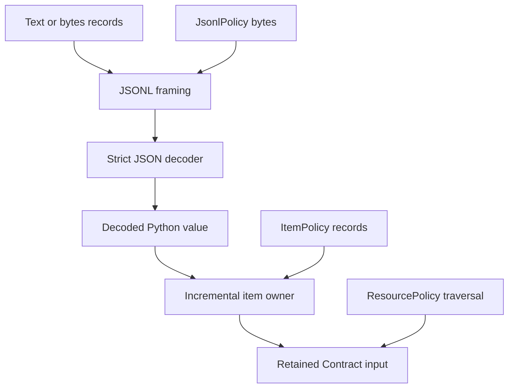

# JSON Lines input

JSON Lines (JSONL, also called newline-delimited JSON) provides the record
boundary that ordinary JSON does not: one complete JSON value per physical
line. Talea consumes an application-owned iterable of text records or bytes
records and yields converted values from one retained `Contract[T]`:

```python
contract = Contract(Trade)

with path.open("rb") as stream:
    for trade in contract.iter_jsonl(stream):
        process(trade)
```

The caller opens and closes the file. Talea does not accept a path, own stdin,
decompress input, read ahead, materialize `list[T]`, or close the underlying
source.

## Format contract

Talea follows the three requirements documented by the authoritative
[JSON Lines format](https://jsonlines.org/): UTF-8 encoding, one valid JSON
value per line, and LF as the line terminator. The format explicitly permits
any JSON value, forbids blank lines and a byte order mark, supports CRLF because
JSON ignores surrounding whitespace, and does not require a terminator after
the final value. [RFC 8259](https://www.rfc-editor.org/rfc/rfc8259) supplies the
underlying JSON grammar, UTF-8 interoperability rule, scalar roots, number
grammar, and whitespace definition.

| Record fact | Talea behavior |
| --- | --- |
| source unit | one yielded `str` or one yielded `bytes` is one complete record, never an arbitrary chunk |
| source consistency | one operation uses text records or bytes records; mixing them raises `TypeError` |
| LF | accepted and treated as the framing terminator |
| CRLF | accepted as one framing terminator |
| bare CR | not stripped as a line terminator; the strict JSON parser may accept it as ordinary trailing JSON whitespace |
| final newline | optional |
| blank record | `""`, `"\n"`, and `"\r\n"` raise `JsonlError(code="blank")` |
| whitespace only | not a blank framing unit, but fails strict JSON decoding because it contains no value |
| BOM | a record beginning with U+FEFF is rejected, including after the first record |
| bytes | decoded with strict UTF-8; replacement characters are never inserted |
| multiline value | rejected; Talea never buffers later source units to complete a value |
| scalar root | `null`, booleans, numbers, strings, arrays, and objects all reach `Contract[T]` normally |

An escaped newline inside a JSON string (`"line 1\nline 2"`) is ordinary JSON
text and remains on one physical record. An actual LF inside one yielded record
violates the framing contract even if a general JSON parser could accept it as
whitespace around an object member.

## Public API

`Contract.iter_jsonl()` returns `Iterator[T]`:

```python
contract.iter_jsonl(
    records,
    *,
    on_error=None,
    on_jsonl_error=None,
    item_policy=None,
    jsonl_policy=None,
    policy=None,
)
```

`records` is `Iterable[str] | Iterable[bytes]`. `on_error` retains the accepted
incremental callback type `Callable[[int, ValidationError], None]`.
`on_jsonl_error` is a separate
`Callable[[int, JsonlError], None]` because framing and syntax fail before a
Python value exists. `ItemPolicy` comes from `talea.contract`; `JsonlPolicy`
and `JsonlError` come from `talea.jsonl`. None of the JSONL-specific names is
re-exported from `talea`.

The operation uses external JSON semantics, like `Contract.from_json()`, not
strict `Contract.validate()` semantics. Mappings can construct Specs and
dataclasses, TypedDicts detach, aliases and tagged unions keep their existing
rules, and Representation loaders execute once. The retained Contract's JSON
input artifact compiles once and is reused for every decoded record.

## Strict JSON semantics

JSONL and ordinary JSON call the same strict decoder owner. JSONL therefore:

- preserves decimal number tokens as `Decimal` before schema-aware conversion;
- rejects duplicate object keys at any depth;
- rejects `NaN`, `Infinity`, and `-Infinity`;
- retains Python's integer string conversion protection;
- applies the same aliases, tagged dispatch, standard-library
  representations, generics, recursion, and validation semantics after decode.

There is no JSONL-specific custom decoder option. `loads=` remains an ordinary
single-document JSON boundary choice and cannot weaken framed ingestion.

## Two failure domains

A malformed record is not a `ValidationError`. UTF-8, BOM, blank-record, and
JSON-syntax failures raise `JsonlError`. Its stable facts are:

| Attribute | Meaning |
| --- | --- |
| `code` | `blank`, `bom`, `invalid_encoding`, `invalid_json`, `duplicate_key`, or `non_finite_number` |
| `line` | one-based physical source record |
| `record_line` | decoder-relative line when safely available |
| `column` | decoder-relative column when safely available |

The exception string contains only category and location. It does not retain
or render the raw record, duplicate key, non-finite token, or underlying
decoder exception. This remains safe when malformed JSON was intended to
contain a Sensitive field.

Once decoding succeeds, Contract conversion failures remain canonical
`ValidationError` values. Their first location segment and callback index are
the zero-based logical item index inherited from `iter_python()`. With exactly
one source item per JSONL record:

```text
validation item index N + 1 == physical JSONL line N + 1
```

Talea does not add a competing line prefix to the validation location.

## Fail-fast and explicit continuation

Both domains default to fail-fast. They have separate callbacks because an
application may accept one recovery policy without accepting the other:

| Configuration | Malformed framing or JSON | Decoded validation failure |
| --- | --- | --- |
| no callbacks | raise `JsonlError` | raise `ValidationError` |
| `on_error` only | raise `JsonlError` | callback may continue |
| `on_jsonl_error` only | callback may continue | raise `ValidationError` |
| both callbacks | JSONL callback owns this failure | validation callback owns this failure |

Returning normally from a callback explicitly skips that record and seeks the
next valid result. No placeholder, `None`, error list, retry, `Result`, or
silent-ignore mode is created. Callback exceptions propagate unchanged.
`ResourceLimitError` is terminal and never enters either callback. An
`OSError`, `RuntimeError`, or other exception raised while the source produces
its next unit also propagates unchanged because no record was supplied.

## Three resource scopes

JSONL keeps three policies separate:



`JsonlPolicy(max_line_bytes=8 * 1024 * 1024, max_total_bytes=None)` is immutable.
The per-line default matches ordinary JSON's 8 MiB transport limit. It counts
the complete source unit in UTF-8 bytes, including LF or CRLF. Text byte counts
are computed without allocating a second encoded copy. `max_total_bytes=None`
is deliberately explicit and permits multi-gigabyte caller-bounded jobs;
select a finite value when the source or consumer does not provide that bound.
Malformed and decoded-invalid records still contribute to total transport
bytes, and byte exhaustion occurs before parsing or callbacks.

`ItemPolicy` owns one logical counter across every physical record: valid,
blank, BOM, invalid encoding, malformed JSON, or decoded-invalid. Its
`max_invalid_items` counter likewise spans continued framing and validation
failures, so alternating failure types cannot evade the budget. Defaults remain
one million pulled records and 100 continued invalid records. `None` explicitly
disables a chosen dimension.

`ResourcePolicy` applies independently to each successfully decoded Python
value. It owns structural depth, compiled node visits, and error aggregation.
JSONL already charged raw transport bytes, so the decoded value does not pay a
second `max_input_bytes` charge. Per-item depth/node/error exhaustion is
terminal.

## Laziness, lifetime, and memory

Creating the iterator validates callback and policy objects but consumes zero
records and does not compile the JSON input artifact. Each `next()` pulls only
enough units to yield the next valid `T` or reach a terminal decision. A
continued malformed or invalid record can therefore cause more than one source
pull before the next result, but there is no lookahead after a result exists.

At most the current source unit, its decoded value, current validation state,
and generator frames are Talea-owned. Prior records, successful values,
continued errors, and callbacks are released after advancement or exhaustion
under normal Python lifetime rules. Separate iterators from one Contract have
independent counters and can reuse the retained artifact concurrently; one
iterator is not made thread-safe.

Closing the returned generator stops Talea without draining or proactively
closing the underlying iterator. Keep a file, cursor, transaction, decompressor,
or socket inside its application context manager. Talea provides no I/O
timeout, retry, async cancellation, source sandbox, or callback sandbox.

## Security boundary and limitations

Finite line bytes prevent one enormous record from reaching the decoder.
Finite total bytes bound aggregate transport when selected. Item and invalid
budgets stop infinite valid or malformed streams. Strict UTF-8, duplicate-key
rejection, non-finite rejection, per-item traversal budgets, Sensitive
validation redaction, and raw-record-free JSONL errors cover Talea-owned work.

The application still owns blocking I/O, file/socket authenticity, source
mutation, decompression, callback logging and work, deterministic source close,
and any explicitly unbounded policy. JSONL input currently provides no path
opening, compression convenience, custom decoder, multiline recovery, async
source, JSONL output, or streaming serialization.

## Performance

JSONL adds record framing, UTF-8 accounting/decoding, strict JSON decode,
generator yield, item accounting, and external Contract conversion. It does
not build a batch, create a Contract per record, or resolve annotations on the
hot path. The permanent `benchmark_jsonl` task measures text/bytes scaling,
supported contract domains, failures and both continuation domains, all three
policy scopes, large lines, allocation/retention, concurrency, the strict
decoder lower bound, an equivalent handwritten loop, and ordinary
JSON/incremental/Settings canaries.

## Complete executable trade import

The following program covers retained compilation, text and bytes, LF/CRLF,
an omitted final newline, laziness, both callbacks, line/index semantics,
Sensitive behavior, all stream budgets, early stop, source exceptions, and a
caller-owned real file:

{!> ../../../docs_src/tutorials/jsonl_input.py !}
