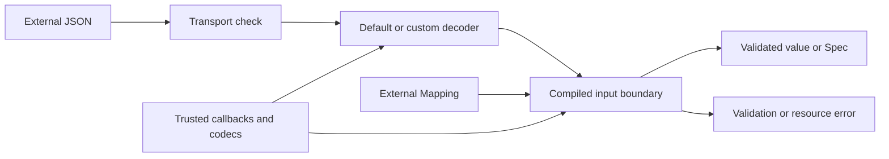

# Resource and security model

Talea is an in-process Python library. It validates and converts data inside the
embedding application's process, with that process's CPU, memory, stack, file,
network, and logging authority. Talea is not a sandbox for Python objects or
application callbacks.

This document defines the technical threat model for external data boundaries.
Vulnerability reporting and support governance are documented separately when
the repository publishes those policies.

## Overview

Python annotations resolve into one canonical schema. Talea compiles that schema
into separate operations for strict validation, external Python input, JSON
input, Python output, JSON output, and standards projection. External input is
the security boundary: JSON is decoded and then passed to a schema-specialized
converter; Python mappings are consumed directly by the same compiled input
owner.

| Component | Responsibility | Source owner |
| --- | --- | --- |
| JSON decoder | Strict default syntax and per-call codec boundary | `talea/input/json.py` |
| Input compiler | Mapping/decoded-tree conversion and validation | `talea/input/` |
| Error model | Bounded projections, rendering, and sensitive redaction | `talea/errors/` |
| Recursive references | Operation-local cycle detection | `talea/input/references.py`, `talea/input/artifacts.py` |
| Declaration compiler | Annotation resolution and generated operations | `talea/schema/`, `talea/spec/` |
| Output compiler | Python/JSON projection and output-cycle rejection | `talea/serialization/` |
| Standards projector | Finite JSON Schema and OpenAPI definition graphs | `talea/json_schema/` |

The important data flow is:



The default JSON decoder rejects duplicate object keys and non-finite numeric
constants and preserves fractional tokens as `Decimal`. A custom decoder owns
its parser behavior. Talea still applies its compiled conversion and validation
to the returned object.

## Accepted resource architecture

`ResourcePolicy` is a frozen, slotted value owned by `talea.resources`. Its
finite defaults are 8 MiB encoded JSON input, structural depth 64, 100,000
compiled schema visits, and 100 aggregated errors. Any dimension may be `None`
when the caller owns that limit elsewhere. There is no mutable global setting.

Specs accept one per-call policy and otherwise use the immutable default.
Contracts may retain one policy; an explicit per-call policy replaces it rather
than merging layers. Each governed operation allocates one small mutable state
object. Generated input operations share that state explicitly, including
recursive back edges, so counters remain local to the call and independent
across threads.

The governed operations are `Spec.from_mapping()`, `Spec.from_json()`,
`Contract.from_python()`, and `Contract.from_json()`. Trusted `Spec(...)`
construction, `Contract.validate()`, serialization, dynamic declaration,
generic specialization, and standards projection are deliberately outside the
policy. Their callers already control the Python objects or declaration graph;
giving these operations superficially similar limit names would mix different
trust and rollback semantics.

Depth is structural: a scalar root is zero, a root container is one, and each
nested container adds one. A work node is one actual generated schema visit or
one member that Talea must convert or detach before that visit. A conversion
reservation is consumed by the later canonical validation visit, so ordinary
input is not counted twice. Attempted union alternatives count, while tagged
unions visit only the selected branch. This total budget subsumes a
per-container limit without conflicting thresholds. Strings, bytes, integer
values, Decimal values, and individual containers have no separate resource
dimension. Those are schema/application constraints; Python 3.14 also rejects
excessively long integer-string conversions.

`max_errors` terminates independent Mapping/JSON failure aggregation at the
first configured count. The `ValidationError.truncated` signal means traversal
was terminated by the budget, not that Talea computed how many failures were
omitted. Depth and node exhaustion raise `ResourceLimitError` with stable
`code`, `limit`, and `observed` integers. The exception retains no input object.

| Resource code | Trigger | Enforcement |
| --- | --- | --- |
| `input_size` | encoded JSON exceeds `max_input_bytes` | reject before invoking the decoder |
| `depth` | structural nesting exceeds `max_depth` | reject at the first excessive path |
| `nodes` | compiled visits or Talea-controlled conversion work exceed `max_nodes` | reject with the first known excessive count |

`max_errors` does not raise `ResourceLimitError`; it returns the deterministic
error prefix in `ValidationError` with `truncated=True`.

## Threat model, trust boundaries, and assumptions

The protected assets are process availability, bounded CPU and memory use,
stack availability, deterministic validation, canonical schema integrity,
sensitive rejected values, generated-code integrity, and the availability of
schema tooling.

The relevant attackers are remote clients or message producers controlling
JSON, same-process callers supplying Python values or `Mapping`
implementations, application developers supplying callbacks and codecs, and
tooling consumers supplying declarations. A remote JSON sender does not thereby
control callbacks, annotations, codecs, process configuration, or release
credentials.

The trust boundaries are:

- JSON text, bytes, or byte arrays cross a transport and parser boundary.
- Decoded containers and external `Mapping` objects cross a compiled traversal
  boundary.
- Arbitrary Python objects passed to strict validation may cross an error
  representation boundary when rejected.
- Annotation functions, dynamic declarations, transforms, checks, factories,
  serializers, patterns, and custom codecs are trusted application code.
- Serialization and schema projection operate on application-owned values and
  declarations rather than remote transports by default.

Talea must preserve these invariants:

- resource settings are immutable and operation-local;
- no request can mutate process-global resource behavior;
- the same limit has one canonical meaning across every governed input path;
- deep or broad hostile input fails deliberately before accidental recursion or
  unbounded aggregation;
- resource exceptions retain numeric observations and bounded metadata, never
  the offending payload;
- sensitive validation failures continue to discard raw values and callback
  causes;
- compiler-owned identifiers and bound runtime objects remain separate from
  user-provided names;
- cycle state and resource counters cannot leak between calls or threads.

## Attack surface, mitigations, and attacker stories

The scenarios below are threat hypotheses. They describe the capability a
control must prevent; they are not vulnerability findings by themselves.

| Priority | Scenario and capability gain | Prerequisites | Impact | Existing controls | Implemented control or decision |
| --- | --- | --- | --- | --- | --- |
| High | Oversized JSON is fully parsed before rejection | Attacker controls a reachable JSON boundary with no earlier transport limit | CPU and memory exhaustion | Strict syntax | Encoded size is checked before every decoder, including custom codecs |
| High | Deep acyclic input exhausts the Python stack | Recursive contract and attacker-controlled nested values | Process or request failure through `RecursionError` | Runtime cycles are rejected | One depth budget spans recursive Spec, alias, and TypedDict input |
| High | Broad input consumes unbounded traversal work | Large or repeatedly nested containers | CPU and allocation pressure | Compiled O(n) traversal | Generated input consumes a total actual-work node budget |
| High | Invalid broad mappings create thousands of rich errors | Many invalid or unexpected members | CPU and retained-memory amplification | Individual representations are bounded | Canonical aggregation stops at `max_errors` and exposes truncation |
| Medium | A large malformed document remains retained by its exception | Caller retains a non-sensitive parser failure | Memory retention beyond request handling | Rendering and causes are bounded | Resource failures retain no input; parser causes are omitted for large transports |
| Medium | Pathological untagged unions repeat expensive work | Developer declares many plausible branches and attacker forces late failure | CPU and diagnostic amplification | Canonical order; tagged unions dispatch directly | Actual attempted branch work consumes the shared node budget |
| Medium | Hostile custom `Mapping` methods or `repr` execute arbitrary work | Same-process/plugin object injection | CPU, side effects, or propagated application exceptions | State cleanup uses `finally`; representation exceptions are caught | No sandbox claim; failures cannot corrupt later operation state |
| Medium | Developer-authored regex catastrophically backtracks | Trusted pattern plus attacker-controlled string | CPU exhaustion | Pattern compiles once; source is not interpolated | Trusted code; application review, constraints, deadline, or isolation owns mitigation |
| Low | Dynamic declarations or specializations create compilation storms | Application exposes trusted declaration APIs to high-cardinality input | CPU and live-object pressure | Weak specialization and introspection caches; per-Contract ownership | Kept outside remote-input policy; caller owns declaration cardinality |
| Low | Schema projection produces a very large document | Tooling operates on a very broad trusted graph | Tooling CPU and memory pressure | Recursive definitions are finite and per-call results are not cached | Kept outside remote-input policy; tooling caller owns graph breadth |

For the accepted input controls, the attack path is always:

```text
attacker-controlled transport or structure
    -> public from_json/from_mapping/from_python operation
    -> parser or generated traversal would consume resources
    -> pre-parse or compiled enforcement point
    -> bounded ResourceLimitError or truncated ValidationError
```

Custom decoders can be protected before invocation by the transport limit and
after invocation by Talea's compiled traversal limits. Talea cannot bound work
performed inside the decoder. The same rule applies to transforms, checks,
factories, serializers, and pattern execution.

## Severity calibration

**Critical** requires a source-backed path to code execution, credential theft,
cross-boundary secret disclosure, or equivalent process authority not already
held by the attacker. Ordinary resource exhaustion is not Critical.

**High** includes remotely reachable, inexpensive input that reliably exhausts
process memory or the Python stack, or causes sustained disproportionate CPU
without an effective application control. A library-only hypothesis is reduced
when no reachable deployment is established.

**Medium** includes bounded-request denial of service, material error or memory
amplification, or conditional secret retention that requires an application to
retain or publish the exception. Developer-authored regex and union shapes are
normally conditional Medium risks because the attacker does not control the
declaration.

**Low** includes trusted tooling or declaration-time exhaustion, weak-cache
creation pressure that requires the caller to keep objects alive, and stale
documentation without a direct security effect. Authorized callback behavior
and effects limited to an attacker-controlled local process are not privilege
gains.

## Caller-owned controls

Talea does not preempt Python code, recover globally from `MemoryError`, impose
timeouts, or sandbox custom objects. Applications remain responsible for
request concurrency, wall-clock deadlines, process isolation, operating-system
limits, safe callback and regex review, and any stricter transport limits
enforced before Talea receives a complete payload. Node accounting stops
Talea-controlled conversion and detachment between members; it cannot preempt a
single custom `Mapping` method or callback that blocks internally. This
technical model does not replace a repository vulnerability-reporting policy
or application threat model.

## Executable hostile-input scenarios

The following program exercises a secret-bearing nested failure, oversized JSON
rejected before decoding, excessive recursion depth, an exhausted compiled-node
budget, truncated broad error aggregation, and a custom Mapping callback that
demonstrates the sandbox boundary.

{!> ../../../docs_src/recipes/errors_and_security.py !}

These cases should be tested with the endpoint's actual maximum shape. A policy
that admits a 500-item batch must count the nested object and scalar visits, not
only the list length. Conversely, raising `max_nodes` globally because one batch
is large weakens unrelated endpoints. Prefer immutable policies retained per
Contract or selected per operation.

When handling errors, keep `ResourceLimitError` separate from
`ValidationError`. The former reports `code`, `limit`, and `observed` and does
not retain the payload. The latter reports contract invalidity and may contain
an intentionally bounded prefix of independent failures; `truncated=True`
means the error budget stopped traversal. Neither exception chooses an HTTP,
queue, or retry policy for the application.

Sensitive redaction is deliberately conservative. A reachable Sensitive field
can redact broader discriminator diagnostics so another failure cannot reveal
secret-adjacent structure. Redaction protects Talea-owned errors and repr; it
does not erase valid objects, prevent explicit serialization, protect
application logs that access a field directly, or neutralize a malicious
callback.
